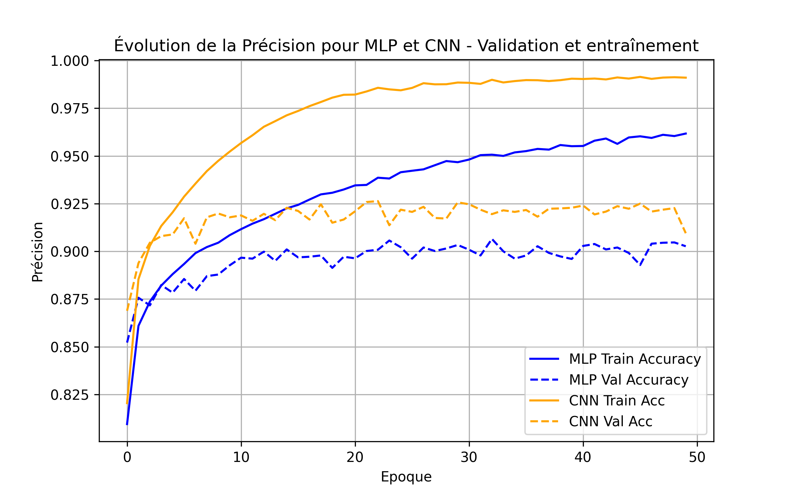
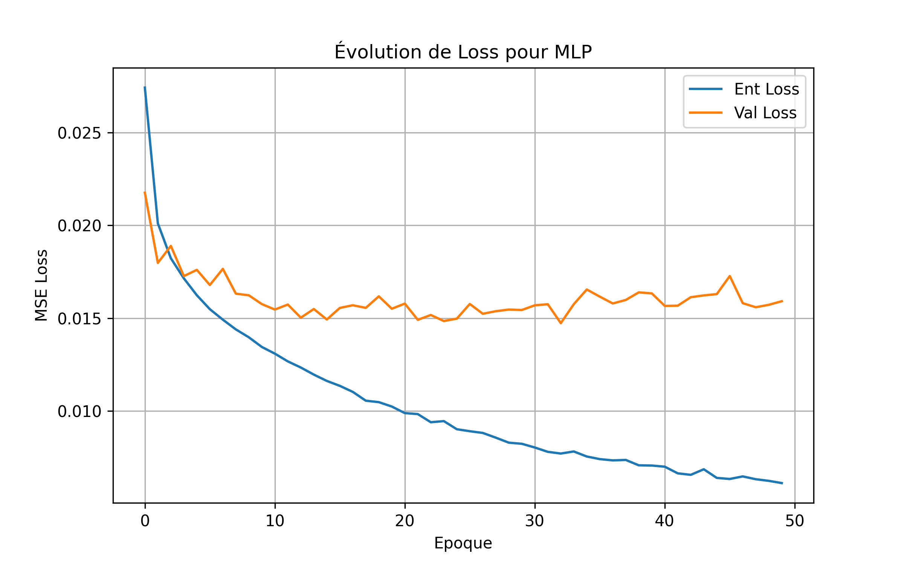
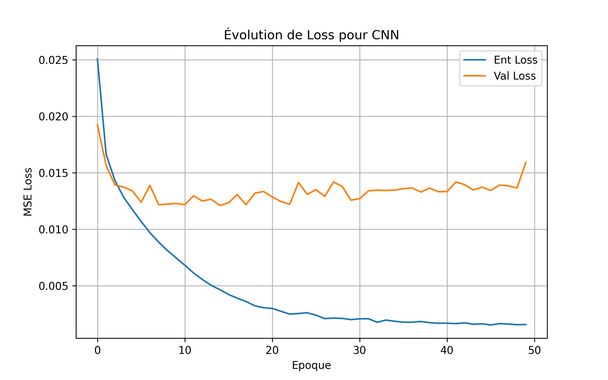
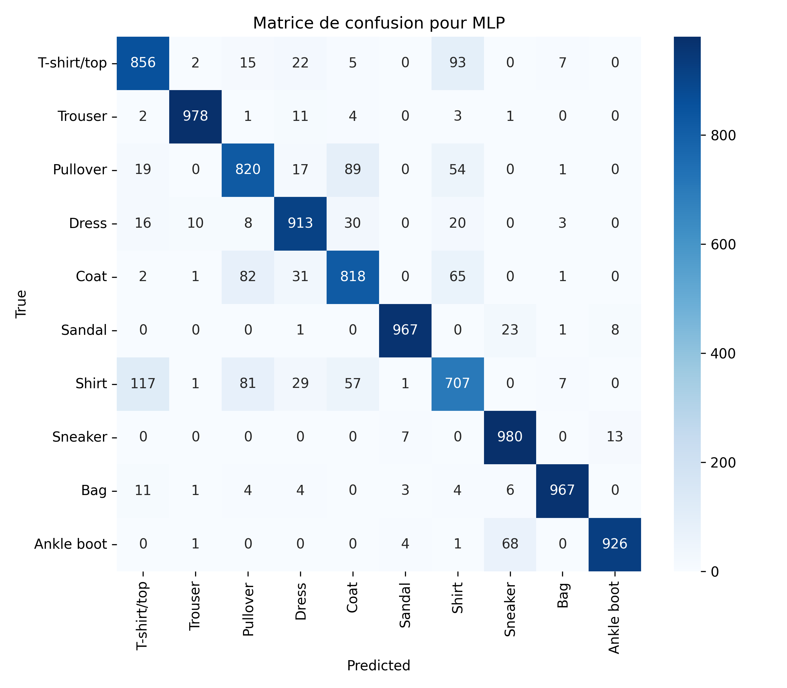
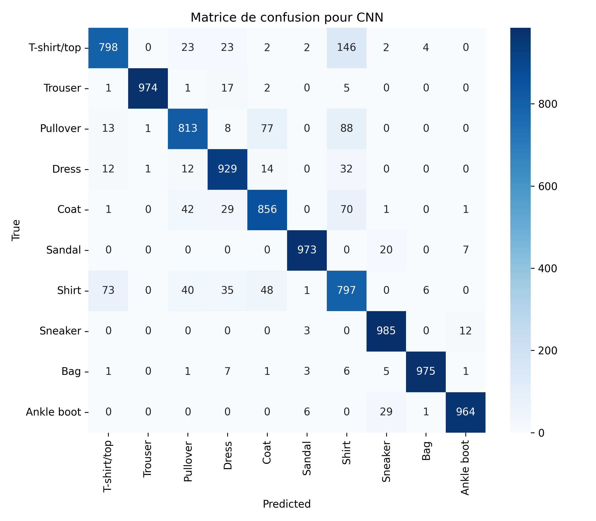

# Neural Networks

## Overview
This project compares two neural network architectures on **Fashion MNIST**:
- **MLP (Multi-Layer Perceptron)** — treats images as flat vectors.
- **CNN (Convolutional Neural Network)** — exploits spatial structure via convolutions.

  

**Dataset:** 70,000 grayscale images (28×28), 10 clothing classes; split into 54,000 train, 6,000 validation, 10,000 test.

---

## Methodology
- **Model architectures**
  - **MLP:** 3 linear layers (784 → 256 → 128 → 10) with ReLU activations and Softmax output.
  - **CNN:** 2 convolutional layers + 2 fully connected layers, with ReLU and Softmax.
- **Training setup**
  - Epochs: **50** 
  - Batch size: **64**
  - Learning rate: **0.001**
  - Loss: **MSE**
  - Optimizer: **Adam**

---

## Results

- **Learning dynamics (MLP vs CNN)**  
    
  *CNN reaches higher validation accuracy and generalizes better; MLP trends toward slight overfitting.*

- **Loss curves**  
  

    
    
  

- **Confusion matrices**  
  

    
    
  

- **Common mix-ups**
  - T-shirt/top ↔ Shirt
  - Pullover ↔ Shirt
  - Pullover ↔ Coat
  - Shirt ↔ Coat.

- **Final accuracies**
  
  | Model | Train (%) | Validation (%) | Test (%) | Train–Val Gap (%) |
  |------:|:---------:|:--------------:|:--------:|:-----------------:|
  |  MLP  |   93.09   |     89.34      |  88.65   |       3.75        |
  |  CNN  |   97.25   |     91.98      |  91.17   |       5.27        |

---

## Conclusion
- **CNN** outperforms **MLP** on Fashion MNIST and shows stronger generalization thanks to convolutional features.  
- **MLP** is simpler and faster to train but displays mild overfitting on this task.

---

## Files  
- [main.py](main.py) → Main script of the experiment
- [Fashion_MNIST_English.pdf](Fashion_MNIST_English.pdf) → Project report
